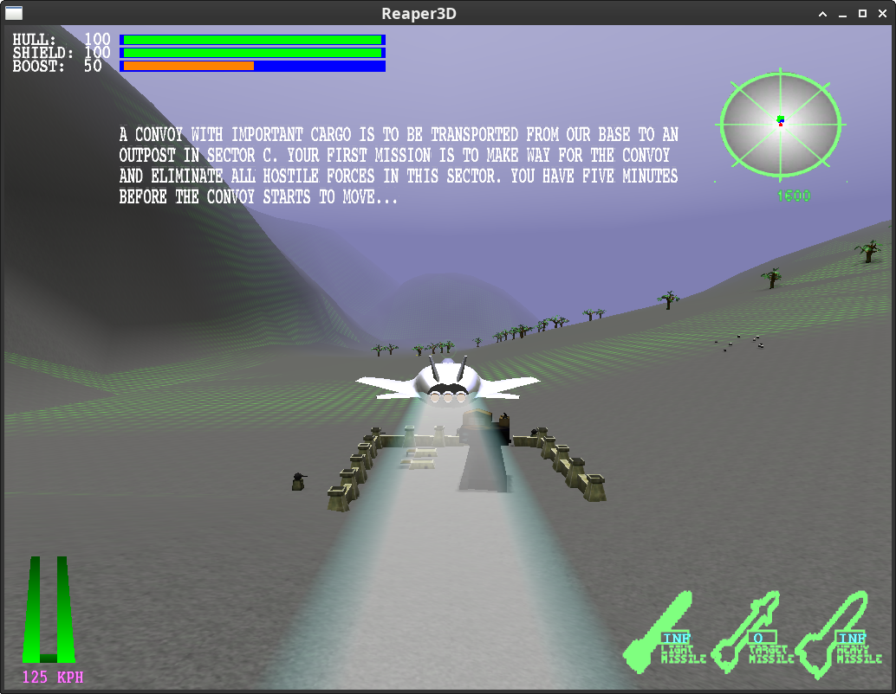

# Reaper3D

Reaper3D is a very old/early (late-1990s/early-2000s) 3D space-combat game
originally hosted at [SourceForge](https://reaper3d.sourceforge.net/) My early
college explorations of the open source landscape of the time included games,
and this one was simple but entertaining.  Originally it started as third year
project by a bunch of students at the Computer Science & Engineering section of
Chalmers University of Technology in Gothenburg, Sweden and evidently got out
of hand.

It doesn't have much game play, but it does function at a basic level (or did
back in the day, at any rate.)  The last update on Sourceforge is from 2002,
and the C++ coding style of the original codebase is a (very) poor fit for
modern compilers.  Modernizing it was of course *much* too heavy of a lift to
justify just for a little nostalgia.

Then AI happened.

It's still not *justified*, of course, but far more practical and, well, er...

Behold! Reaper3D lives:



The game is functional at a basic level: it opens a GLFW window, displays the
menu, loads the supplied level and assets, and runs the 3D game loop. It
remains an early open-source game rather than a finished commercial product.
We kept the original game and data while updating the build and platform layer
for current Linux systems - there's no intent to expand it beyond what it was.

## Controls

The default game mapping is defined in [`data/config/hw_event_game_map.defaults`](data/config/hw_event_game_map.defaults). Controls are intentionally sensitive, especially mouse steering.

### Player 1

| Action | Keyboard | Mouse / joystick |
| --- | --- | --- |
| Steer | Arrow keys | Mouse movement or joystick axes |
| Set thrust | `A` / `Z`; `1`–`5` for preset levels | Joystick throttle axis |
| Boost | `Q` or `End` | Right mouse button or joystick button 1 |
| Fire laser | `Space` or `Delete` | Left mouse button or joystick button 0 |
| Fire missile | `M` | Middle mouse button or joystick button 2 |
| Select missile | `N` | — |

### Player 2 in split-screen mode

Player 2 uses the arrow keys to steer, `Page Up`/`Page Down` for thrust, `End` for boost, `Space`/`Delete` for the laser, and `M` for missiles. Joystick buttons 3 and 4 provide boost and missile controls respectively.

### In-game and menu commands

| Key | Action |
| --- | --- |
| `Escape` | Back out of a menu or leave the current game |
| `F1`–`F8` | Select camera; `F3` selects the internal HUD view |
| `F11` | Save a state snapshot as `latest` |
| `F12` | Leave the game |
| `R` | Cycle radar range |
| `W` | Cycle timing and graphics statistics |
| `F` | Toggle the FPS display |
| `6` | Cycle texture detail |
| `7` | Toggle lighting |
| `8` | Toggle the sky |
| `9` | Toggle terrain |
| `0` | Toggle fog |
| `Y` | Cycle shadow mode |
| `U` | Toggle visual effects |
| `I` | Take a screenshot in `data/screenshots` |
| `P` | Pause or resume |
| `T` / `G` | Increase or decrease simulation time scale |
| `S` / `X` | Decrease or increase terrain detail |
| `D` | Cycle texture scaling and purge cached textures |

## Current status

- The project builds with CMake and C++17 on Linux.
- GLFW is the default windowing and input backend.
- The legacy fixed-function OpenGL renderer runs in a GLFW window with configurable windowed/fullscreen modes.
- The original resource data, menu system, level loading, scenario system, physics, AI, HUD and gameplay loop are included.
- Linux builds use OpenAL Soft for sound effects and audio decoding, with a silent fallback when no audio device is available.
- Optional OSMesa smoke-test programs build when OSMesa development headers and libraries are available.
- When OSMesa is available, the three graphics smoke tests are registered with CTest.

## Building

### Dependencies on Ubuntu/Debian

```bash
sudo apt-get update
sudo apt-get install -y \
    build-essential \
    cmake \
    libglfw3-dev \
    libgl1-mesa-dev \
    libopenal-dev \
    zlib1g-dev \
    libpng-dev \
    pkg-config
```

For the optional headless graphics tests, also install `libosmesa6-dev`.

### Build and run

```bash
git clone https://github.com/starseeker/reaper3d.git
cd reaper3d
cmake -S . -B build
cmake --build build -j$(nproc)

# Run from the build directory so the copied data directory is found.
cd build
./bin/reaper3d
```

Useful command-line options include:

| Option | Purpose |
| --- | --- |
| `-f` | Skip the menu and start the game directly |
| `-g` | Print all debug messages to standard error/output |
| `-d <dir>` | Add a data directory |
| `-r <dir>` | Use `<dir>/data` as an additional game root |
| `-l` | Restore the last saved game state, when available |
| `-h` | Print command-line help |

The CMake build copies `data/` into `build/data/`, so no separate data package is needed for this checkout.

### Graphics smoke tests

When OSMesa is available, the build also produces small headless rendering tests:

```bash
ctest --test-dir build --output-on-failure
```

The tests write comparison images into `build/` and do not launch a window.

The former GLUT/GLUI editor entry points are now GLFW-based Dear ImGui tools:

```bash
./build/bin/level_editor
./build/bin/navigraph_editor
```

They provide the modern window, input, document controls, navigable grid
viewport, and level metadata loading/saving through the existing resource
system. The navigation editor also opens AI graph resources, while object
placement and graph-node editing remain under migration;
the old GLUI frontends are no longer part of the build.

## Project structure

The source is organized into static-library components:

| Directory | Responsibility |
| --- | --- |
| `src/ai` | AI and navigation |
| `src/game` | Game state, missions, menus and scenarios |
| `src/gfx` | OpenGL renderer, terrain, objects, HUD and effects |
| `src/hw` | GLFW, OpenGL context, input, sound abstraction and timing |
| `src/main` | Numeric and matrix types |
| `src/net` | Networking support |
| `src/object` | Game-object implementations and factories |
| `src/phys` | Physics and collision handling |
| `src/res` | Resource and configuration management |
| `src/world` | World and level data |
| `src/ext` | Bundled third-party and compatibility code |

## Remaining work

The supported Linux game build is C++17-clean and uses modern ownership and STL facilities. Remaining work is concentrated in rendering, tooling, coverage, and optional legacy code:

- **Complete the rendering modernization.** The game still relies primarily on OpenGL 1.x fixed-function/immediate-mode rendering. The VBO and GLSL code is currently framework/test infrastructure, not the main renderer.
- **Expand headless coverage.** The full game starts with `REAPER_HEADLESS=1`; automated frame-loop and input assertions are still needed.
- **Finish the Linux audio path.** OpenAL Soft provides effects and buffered WAV/MP3 playback; true streaming music and Windows audio support remain.
- **Improve portability and dependency boundaries.** GLFW and OpenAL Soft are the Linux runtime backends; Windows audio and other platform builds remain future work.
- **Add broader automated regression coverage.** CTest now covers headless rendering, VBO conversion, and shader fallback; startup, input, resource loading, and audio assertions remain.
- **Finish editor interaction.** The GLFW/ImGui editors have camera/grid controls, editable level metadata, and navigation-resource loading; object placement, renderer integration, and graph-node editing remain.
- **Retire remaining dormant legacy code.** Old physics/Voronoi helpers and bundled GLH/GLUI sources remain in the tree only where they are still referenced or useful for migration.

## License

Reaper3D is distributed under the GNU General Public License version 2. See [`LICENSE`](LICENSE).
